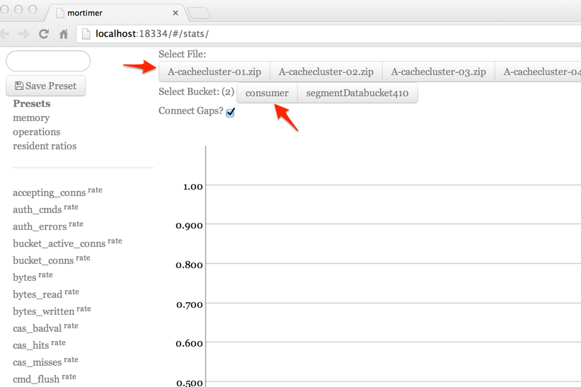
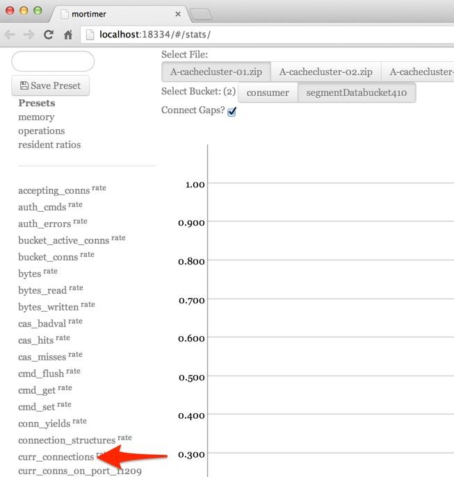
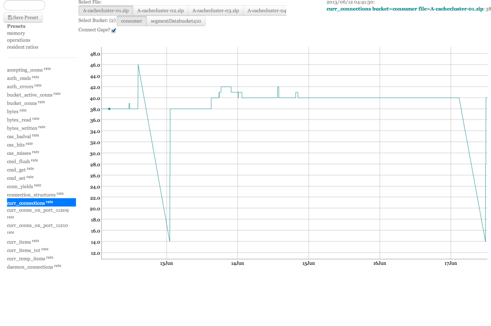
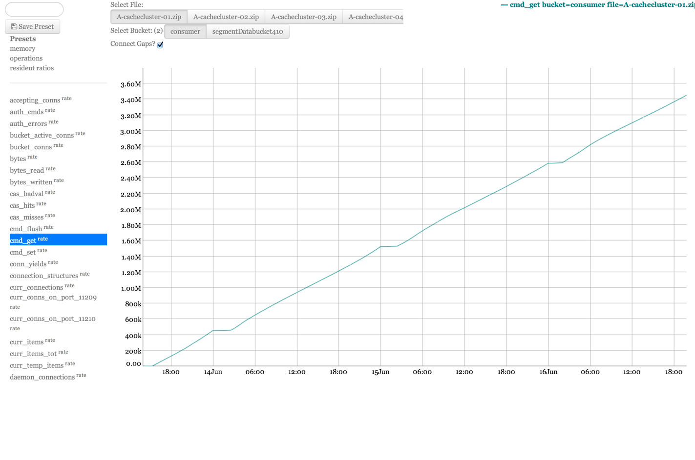
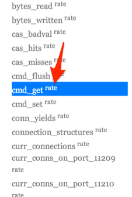
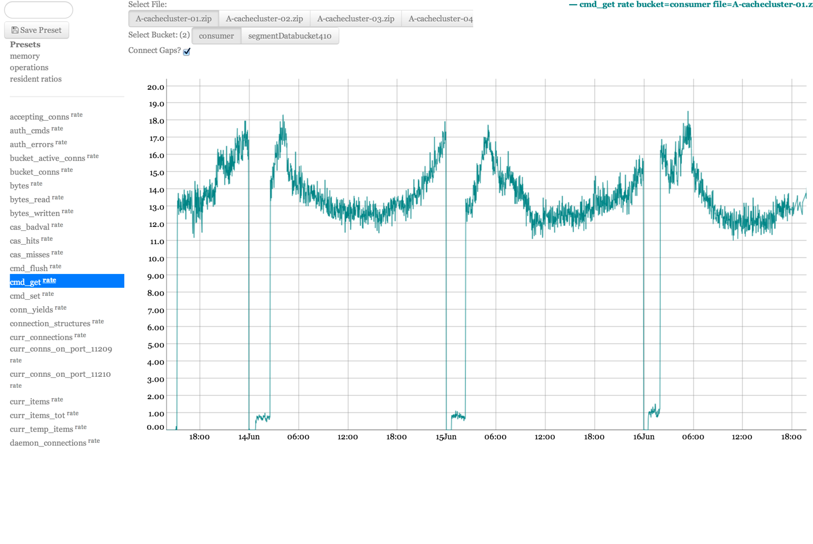
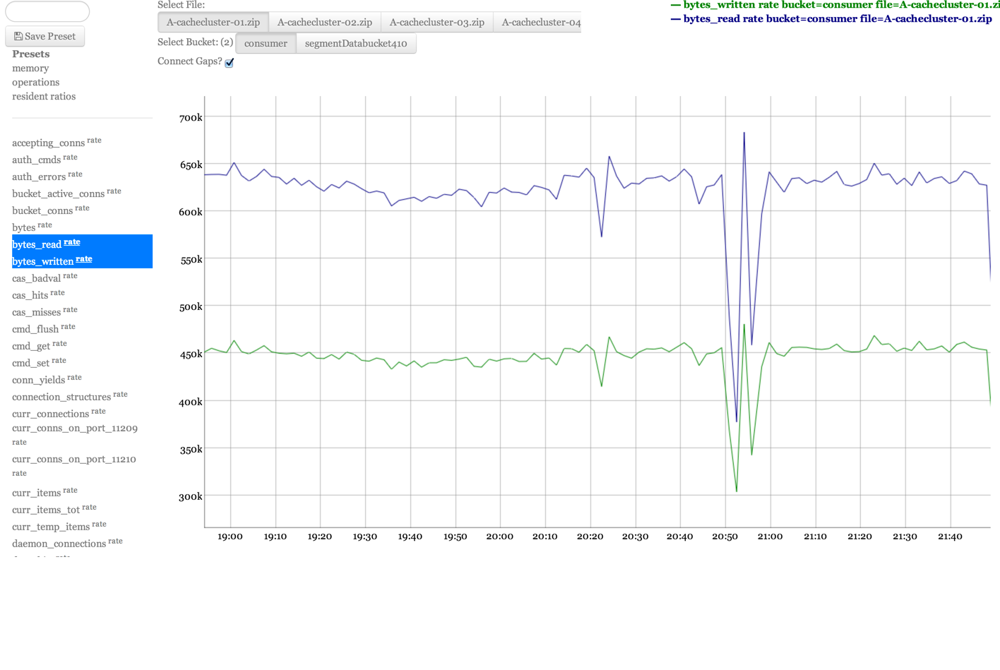
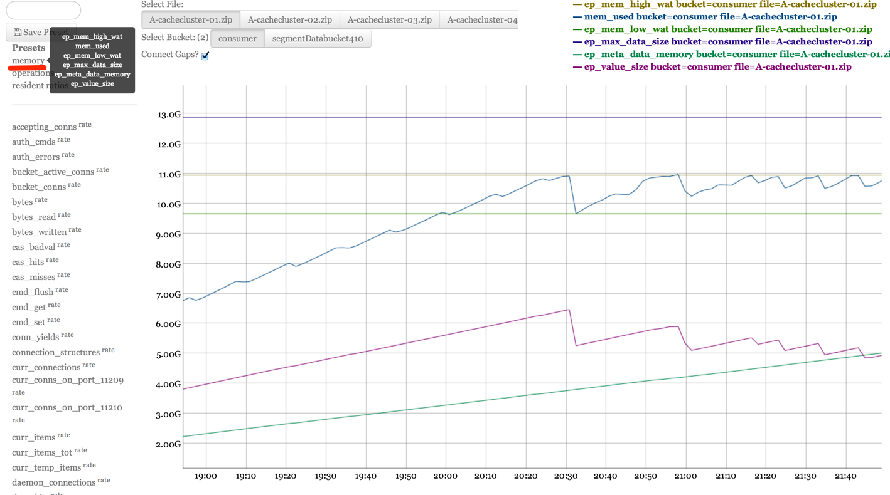
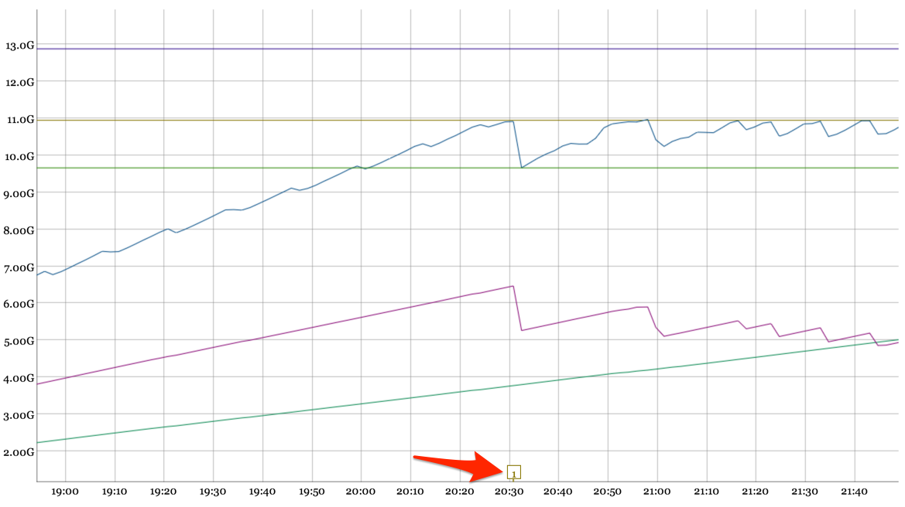

# mortimer

Currently I can

 * Read ep\_engine stat information from `ns_server.stats.log` in `cbcollect_info` zip files (2.0+)
 * Graph those on a Web UI

TODOs: [see tag `mortimer` on cbugg][cbg]

File feature requests and bugs on
[cbugg](http://cbugg.hq.couchbase.com/), and tag them `mortimer`

[cbg]: http://cbugg.hq.couchbase.com/search/tags:mortimer%20AND%20status:(inbox%20OR%20new%20OR%20open%20OR%20inprogress)

Download the .jar at <http://s3.crate.im/mortimer-build/mortimer.jar>

Documented Clojure code at <http://s3.crate.im/mortimer-build/mortimer-doc.html>

# How to Use

## Starting mortimer

Mortimer is a JVM application. Download the .jar, and place it in a
well known location.

To run it, type

    java -jar ~/path/to/mortimer.jar

By default, the current working directory will be searched for
`cbcollect_info` ZIP files, and the mortimer web UI will be started on
port 18334.

Each of these can be changed with command line flags.

    Usage:

      Switches                   Default  Desc
      --------                   -------  ----
      -p, --port                 18334    Start webserver on this port
      -d, --dir                  .        Directory to search for collectinfo .zips
      -v, --no-debug, --debug    false    Enable debugging messages
      -u, --no-update, --update  true     Check for updates
      -n, --no-browse, --browse  true     Auto open browser
      -h, --no-help, --help      false    Display help   

If loading files is slow (or you get an `OutOfMemoryError` exception),
try giving the JVM more RAM:

    java -Xmx2g -jar ~/path/to/mortimer.jar

Adding the option `-Djava.awt.headless=true` to the `java` command line
to prevent java from unecessarily adding an icon to your OSX dock.

    java -Djava.awt.headless=true -jar ~/path/to/mortimer.jar

It can be useful to keep mortimer in a well known location and create a
shell alias to launch it:

    wget -O ~/mortimer.jar http://s3.crate.im/mortimer-build/mortimer.jar

And in your `.bashrc` or equivalent:

    alias mortimer='java -Djava.awt.headless=true -jar ~/mortimer.jar'

## Keyboard Shortcuts

* `/` - focus search field, opening drawer if closed
* `j`, `k` - choose next/previous stat
* `cmd+j`, `cmd+k` - choose next/previous file
* `shift+j`, `shift+k` - choose next/previous bucket
* `enter` - chart stat at cursor
* `cmd+enter` - add stat at cursor to chart
* `r` - chart rate of stat at cursor
* `cmd+r` - add rate of stat under at to chart
* `>`, `<` - open or close drawer
* `q` - toggle multi-window sync push from this window
* `gg` - move cursor to top of stat list

## Charting stats

Start by selecting a file and bucket to pull stats information from:

Click the name of the stat you want to chart:

And that stat will be plotted in the chart area:

You can click and drag on the chart to zoom in, hold Shift to pan, and
double click to reset the zoom level.

## Showing rates

Some stats track totals, such as total number of bytes, or operations.

You can click "rate" next to a stat to plot its rate of change.

## Multiple stats

You can hold down the Command or Control keys while clicking on stats to
add multiple stats to the chart.

## Presets

Mortimer comes with preset combinations of stat selections that are
commonly useful.

You can also *save* your current selection of stats as a preset using the
Save Preset button.

## Setting Markers

You can hold Command or Control and click on the chart, to place a
marker.

Markers will stay on the chart while selecting different stats, allowing
you to keep track of significant points in time as you explore data.

You can hold Shift and click on a marker to delete it.

